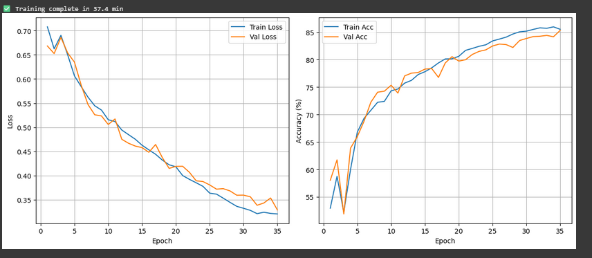
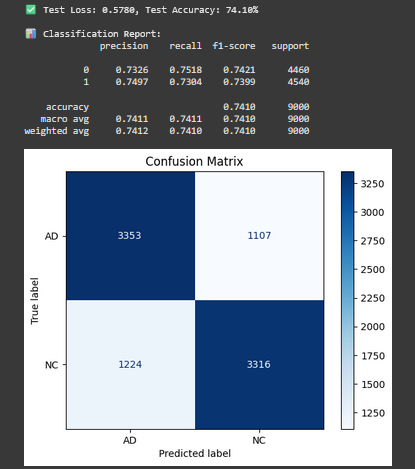

# ANDI Alzheimer's Classifier using ConvNeXt

## 1. Introduction

ConvNeXt is a new and updated CNN architecture that combines elements of ResNet with design features from Vision Transformers (ViTs). While more traditional CNN's like ResNet are efficient and scalable, ViT's are strong at dealing with larger scale datasets, and more specific normalization/regularisation techniques. ConvNeXt provides the best of both of these architectures combining features from both approaches.

## 2. Model 

### 2.1 Model innovations and strengths

#### Patchify Stem:
Replaces standard 7*7 convolution from other CNN's to a 4 * 4 convolution of stride 4. This is adapted from patch embedding of ViTs.
Creates non-overlapping patches, increasing efficiency and performance over other CNNs.
Helps the network scale efficiently to high-resolution images while preserving representational power, similar to how ViTs process patch sequences.

#### Stagewise Architecture:
ConvNeXt uses a four-stage hierarchical structure, where each stage operates at progressively lower spatial resolutions and higher feature dimensions.

#### Inverted Bottleneck Blocks:
Each ConvNeXt block follows an inverted bottleneck design, where the feature dimension is first expanded, then processed with convolution.
Uses GELU instead of RELU to match transformer architectures and for better performance.

#### Layer Normalization:
Uses layer instead of batch normalization for transformer compatibility and better training stability.

#### Depth wise Separable Convolutions
Employs depthwise convolutions in each block, separating channel-wise and spatial convolutions.
This design significantly reduces computational cost and parameter count while allowing the network to be both deeper and wider.

### 2.2 Model Architecture

The following diagram illustrates the overall structure of the ConvNeXt architecture, showing how the network processes input images from low-level features to high-level representations. Each block in the network is composed of depthwise convolutions, layer normalization, pointwise (1×1) convolutions, and GELU activations, forming the computational structure of the network.

**Figure 1:** Structure of the model (GeeksforGeeks, 2025)

### 2.3 Architecture components

#### Stem
Takes a standard 224*224*3 image as RGB input and convolves using a 4*4 kernel and stride 4.
The output is a 56×56×96 feature map, where each pixel represents a learned embedding of a 4×4 region of the image.

#### Stage 1
Applies Depthwise Convolution on the 56×56×96 feature map from the stem.
Applies layer Normalization to stabilize training.
Extracts low-level textures.

#### Stage 2-3
Downsamples further to 28*28*192 and then to 14*14*384, getting more mid level feature details.

#### Stage 4
Feature extraction at 7*7*768. 
Feature map is averaged, aggregating information across the entire image. 
Vector is normalized and passed through a softmax function which creates class probabilities.

#### Stage 5
Classification of image given logit probailities to sort into AD and NC.

## 3. Dataset

This implementation of ConvNeXT uses the ANDI Alzheimer's data set of brain MRI data. There are around 27k samples that are used by the model for training/testing purposes. This data has been processed into greyscale and has been sorted into train and test data based on AD (non-healthy) and NC (healthy) data. There  Each image has been resized into the default format for ConvNeXt (224*224) and has then been converted to a torch tensor. In order to improve the quality of model training, images in the dataset have been augmented by randomly flipping, rotating, and translating to ensure that the model is robust and will not overfit the training dataset. The train data was further partitioned into a smaller validate set for hyperparameter tuning.

**Figure 2:** A sample input image from the dataset

## 4. Training
The model is set to train using binary class classification by sorting images into healthy and unhealthy data. Each iteration of training is a forward pass of the model, where images are processes to create class preidictions. Predictions are then compared to the ground truth labels. 

For training, the data is split 85:15, where the 15% is data that is randomly partitioned as a validate set. This is used to tune paramaters during training to ensure that the models training is balanced.

Training parameters and regularization techniques have been optimized to ensure robust convergence and reduce overfitting.

### 4.1 Parameters of training

#### Learning rate
Reflects the rate at which model adjusts hyperparameters in response to error or varied training data.

#### Weight decay
Reduces tendency towards overfitting by penalizing large weights. Is regulated using AdamW in order to optimize for varied losses, reducing the likelyhood of overfitting.

#### Batch size
Number of samples processed together during a single iteration.

#### Data Augmentation
To enhance generalization, training images are augmented through techniques like random flips, rotations, and translations, allowing the model to learn invariances in potential data.

### 4.2 Indicators of accuracy

#### Accuracy
Indicates the proportion of correctly sorted images compared to the train/validate classifications. Seperaet values of accuracy for the test and validation sets are maintained.

#### Cross-entropy loss
Calculated as BCE=−N1​Σi=1N​(yi​.log(pi​)+(1−yi​)log(1−pi​)), where N is no. samples, yi is true label and pi is predcited probability of class 1 for sample i

Measures the closeness of a models predictions to that of the correct classification.

### 4.3 Training Results
The following graphs plot each epoch against the accuracy and cross entropy loss respectively of each of the train and validation data sets. As is shown, the validation dataset tends to trail behind the training set in terms of increasing accuracy and reducing loss as the epochs progress. This makes sense as the model is the most familiar with the train set. By the end of training cross entropy loss stabilised at ~0.35 for both sets, while accuracy exceeded 85% for both sets. This indicates good model perfromance on these datasets and that overfitting is minimal due to the reliatively strong corrilation bertween train and validate set improvements.

**Figure 3:** Epochs plotted against accuracy and loss

### 4.4 Challenges and how they were overcome

#### Overfitting
Early in development overfitting was a signifcant probelem for this model. This was mitigated by the use of data augmentation on the test set incluidng varitions in the data so that the model does not get to accustomed to the train set.

A dropout of data was introduced to reduce overfitting trends. This reduced the rate of accuracy imporvement, but resulted in a slight increase to generalizability 

Overfitting was also mitiagted by adjusting hyperparamaters such as weight drop and learning rate

#### Model size
ConvNeXt offers a range of model sizes, and it was assumed early in devlelopment that the smallest models possible ( tiny or nano) would be the most effective due to only 2 classification factors and a small dataset. It was later discovered that increasing this was decraesing the accuracy of the model unessasarily due to decreased model depth. Beacuse of this, ConvNeXt Small parameters were used instead. 

## 5. Predict
Provides function for saving and testing the model on the test set. During training, the current best model is saved each time validation accuracy is imporved. Then after training, the best model is tested against the test set to get a final accuracy score based on test accuracy. The current best acheived result on the test set is 74.10%. This indicates a decent result, but a notable drop in accuracy compared to the train and validation accuracies achived on this model. It was also found that the model has a slight bias towards classifying AD samples as NC in the test set, which is a weakness of this implmentation. Therfore it can be concluded that a weakness of this model in its current implementation is its struggles with generalizability.

### 5.1 Confusion Matrix

**Figure 4:** Test set results

The confusion matrix provides a detailed breakdown of prediction outcomes

True Positives (TP): AD correctly classified as AD

True Negatives (TN): NC correctly classified as NC

False Positives (FP): NC misclassified as AD

False Negatives (FN): AD misclassified as NC

This is shown above along with overall accuracy as a heat based distribution above.

## 6. Dependencies
    pip install Python 3.x
    pip install torch
    pip install torchvision
    pip install numpy
    pip install PIL
    pip install tqdm
    pip install glob
    pip install matplotlib
    pip install sklearn

## 7. References

GeeksforGeeks. (2024, January 3). What Is CrossEntropy Loss Function? GeeksforGeeks. https://www.geeksforgeeks.org/machine-learning/what-is-cross-entropy-loss-function/

GeeksforGeeks. (2025, July 14). ConvNeXt. GeeksforGeeks. https://www.geeksforgeeks.org/computer-vision/convnext/

‌Liu, Z., Mao, H., Wu, C.-Y., Feichtenhofer, C., Darrell, T., Xie, S., Facebook, A., & Research. (n.d.). A ConvNet for the 2020s. https://arxiv.org/pdf/2201.03545

‌

 

